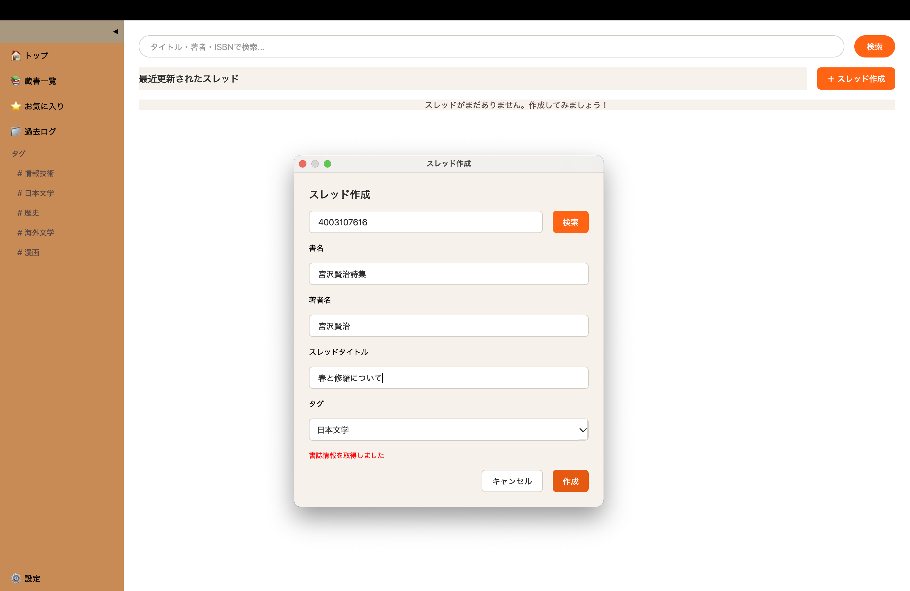
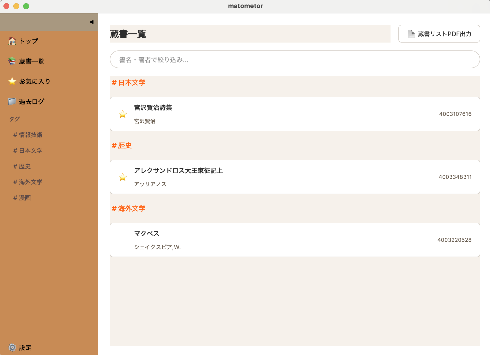
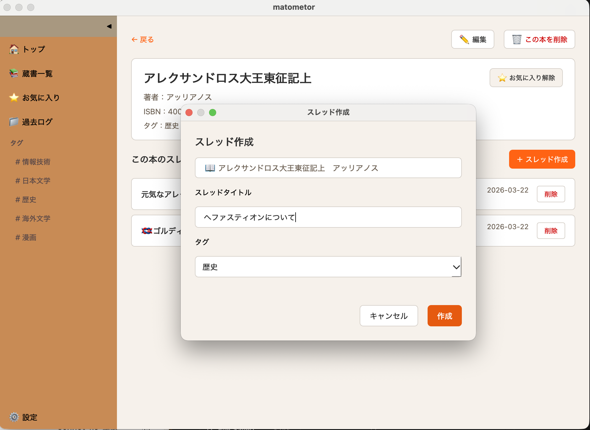
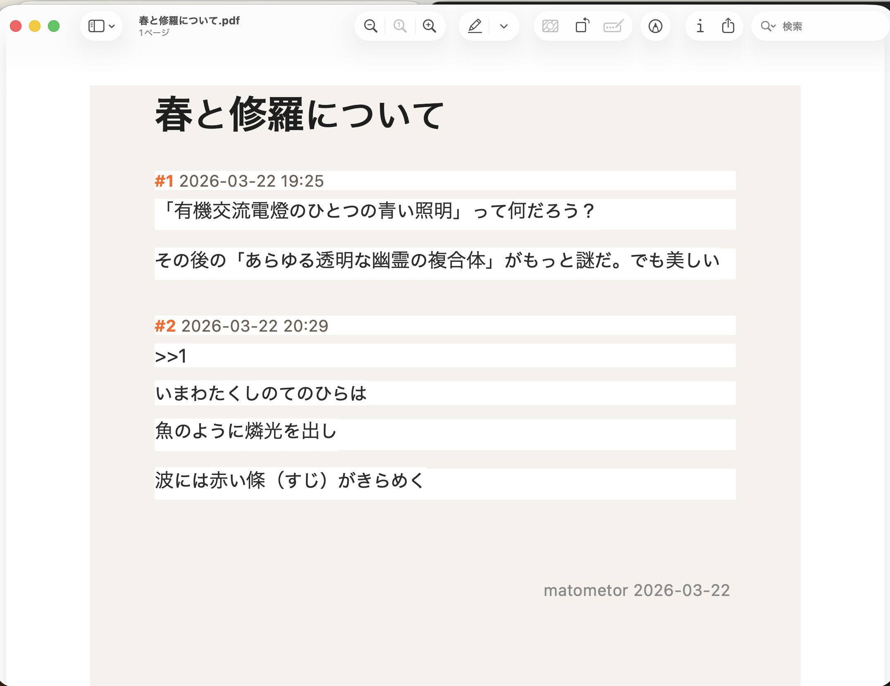
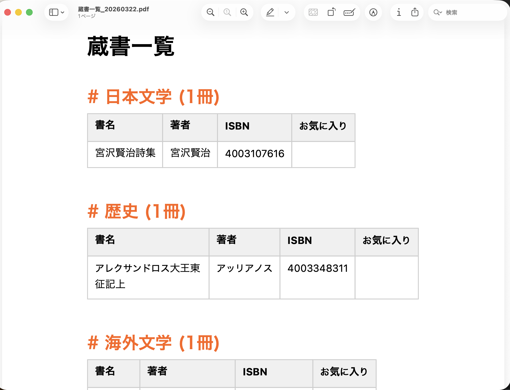

# matometor

蔵書記録・管理デスクトップアプリケーション

本の内容をインターネットの掲示板風スレッド形式でまとめることができる個人用ツールです。読み返し・振り返りを容易にし、読書日記としても活用できます。

---

## スクリーンショット







---

## 機能

- スレッド形式で本の内容をまとめられる
- レスへのアンカー機能（`>>番号` でジャンプ）
- 100レスで自動的に過去ログへ移動・次スレ作成
- ISBN入力でGoogle Books APIから書誌情報を自動補完
- タグ（ジャンル）による蔵書管理
- お気に入り登録
- タイトル・著者・ISBN・本文の横断検索
- スレッド・蔵書リストのPDF出力
- データのバックアップ・JSONエクスポート

---

## 動作環境

- macOS / Windows
- Python 3.9以上

---

## セットアップ

### 1. リポジトリをクローン
```bash
git clone https://github.com/あなたのユーザー名/matometor.git
cd matometor
```

### 2. 仮想環境を作成・有効化
```bash
python3 -m venv .venv

# Mac
source .venv/bin/activate

# Windows
.venv\Scripts\activate
```

### 3. 依存パッケージをインストール
```bash
pip install -r requirements.txt
```

### 4. Google Books APIキーを設定（任意）

ISBNによる書誌情報の自動補完を使う場合は、Google Books APIキーを取得して設定してください。

[Google Cloud Console](https://console.cloud.google.com/)でAPIキーを取得後、プロジェクトルートに`.env`ファイルを作成してください。
```
GOOGLE_BOOKS_API_KEY=あなたのAPIキー
```

APIキーがなくても手動入力で本を登録できます。

### 5. 起動
```bash
python main.py
```

---

## Macでワンクリック起動

`run.command`をダブルクリックするだけで起動できます。

---

## 技術スタック

| 項目 | 内容 |
|------|------|
| 言語 | Python |
| UIフレームワーク | PyQt6 |
| データベース | SQLite（ローカル） |
| 外部API | Google Books API |
| PDF出力 | PyQt6 QPrinter |

---

## ライセンス

MIT License
```

---

次に`requirements.txt`を作成してください。
```
PyQt6
PyQt6-Qt6
PyQt6-sip
PyQt6-WebEngine
python-dotenv
